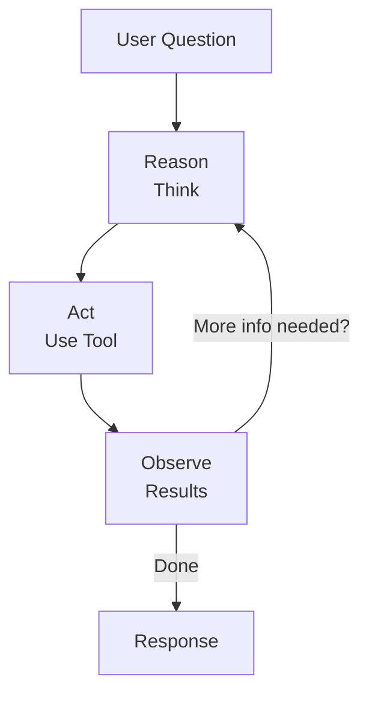

# LangChain ReAct Agent with Web Search Guide

**Date:** December 23, 2025

This guide explains how to build a ReAct (Reasoning + Acting) agent using LangChain that can search the web to answer user questions. The focus is on simple LangChain-based logic without LangGraph-specific concepts.

---

## Table of Contents

1. [What is a ReAct Agent?](#what-is-a-react-agent)
2. [Installation](#installation)
3. [Setting Up the Environment](#setting-up-the-environment)
4. [Web Search Tools](#web-search-tools)
5. [Creating the Agent](#creating-the-agent)
6. [Invoking the Agent](#invoking-the-agent)
7. [Streaming Responses](#streaming-responses)
8. [Custom Tools](#custom-tools)
9. [System Prompts](#system-prompts)
10. [Complete Examples](#complete-examples)
11. [Best Practices](#best-practices)

---

## What is a ReAct Agent?

A **ReAct Agent** combines **Reasoning** and **Acting** in an iterative loop:

1. **Reason**: The LLM analyzes the user's question and decides what action to take
2. **Act**: The agent executes a tool (e.g., web search) to gather information
3. **Observe**: The agent receives the tool's result
4. **Repeat**: The agent reasons about the result and decides if more actions are needed
5. **Respond**: When enough information is gathered, the agent provides a final answer



---

## Installation

### Required Packages

```bash
# Core LangChain
pip install langchain

# Web search tool (Tavily)
pip install langchain-tavily

# Community tools (includes TavilySearchResults alternative)
pip install langchain-community

# LLM provider (choose one or more)
pip install langchain-openai      # OpenAI
pip install langchain-anthropic   # Anthropic Claude
pip install langchain-google-genai # Google Gemini
```

### Using UV (Recommended)

```bash
# Create project and add dependencies
uv init my-search-agent
cd my-search-agent

uv add langchain langchain-tavily langchain-community
uv add langchain-anthropic  # or your preferred provider
```

---

## Setting Up the Environment

### API Keys

You need API keys for:
1. Your LLM provider (OpenAI, Anthropic, etc.)
2. Tavily Search API (get a free key at https://tavily.com)

```python
import os

# LLM Provider (choose one)
os.environ["OPENAI_API_KEY"] = "sk-..."
os.environ["ANTHROPIC_API_KEY"] = "sk-ant-..."
os.environ["GOOGLE_API_KEY"] = "..."

# Azure OpenAI (alternative to direct OpenAI)
os.environ["AZURE_OPENAI_API_KEY"] = "your-azure-key"
os.environ["AZURE_OPENAI_ENDPOINT"] = "https://your-resource.openai.azure.com/"
os.environ["AZURE_OPENAI_API_VERSION"] = "2024-02-15-preview"
os.environ["AZURE_OPENAI_DEPLOYMENT"] = "your-deployment-name"

# Tavily Search API
os.environ["TAVILY_API_KEY"] = "tvly-..."
```

Or use a `.env` file:

```bash
# .env
ANTHROPIC_API_KEY=sk-ant-...
TAVILY_API_KEY=tvly-...

# For Azure OpenAI (alternative to direct OpenAI)
AZURE_OPENAI_API_KEY=your-azure-key
AZURE_OPENAI_ENDPOINT=https://your-resource.openai.azure.com/
AZURE_OPENAI_API_VERSION=2024-02-15-preview
AZURE_OPENAI_DEPLOYMENT=your-deployment-name
```

```python
from dotenv import load_dotenv
load_dotenv()
```

### Using Azure OpenAI

If you're using Azure OpenAI instead of direct OpenAI, you have two options:

**Option 1: Using init_chat_model with model_provider**

```python
from langchain.chat_models import init_chat_model

model = init_chat_model(
    os.environ["AZURE_OPENAI_DEPLOYMENT"],
    model_provider="azure_openai"
)
```

**Option 2: Using AzureChatOpenAI directly**

```python
from langchain_openai import AzureChatOpenAI

model = AzureChatOpenAI(
    azure_deployment=os.environ["AZURE_OPENAI_DEPLOYMENT"],
    azure_endpoint=os.environ["AZURE_OPENAI_ENDPOINT"],
    api_key=os.environ["AZURE_OPENAI_API_KEY"],
    api_version=os.environ["AZURE_OPENAI_API_VERSION"],
)
```

---

## Web Search Tools

### Tavily Search

Tavily is a search API optimized for LLMs, providing clean, relevant results.

#### Basic Setup

```python
from langchain_tavily import TavilySearch

# Create search tool with max 3 results
search_tool = TavilySearch(max_results=3)

# Test the tool directly
results = search_tool.invoke("What is the capital of France?")
print(results)
```

#### Tavily Search Results Structure

```python
{
    'query': "What is the capital of France?",
    'follow_up_questions': None,
    'answer': None,
    'images': [],
    'results': [
        {
            'title': 'Capital of France - Wikipedia',
            'url': 'https://en.wikipedia.org/wiki/Paris',
            'content': 'Paris is the capital and largest city of France...',
            'score': 0.95,
            'raw_content': None
        },
        # ... more results
    ],
    'response_time': 1.2
}
```

#### Alternative: TavilySearchResults

For simpler result format:

```python
from langchain_community.tools.tavily_search import TavilySearchResults

# Returns a list of result dictionaries
search_tool = TavilySearchResults(max_results=3)
```

---

## Creating the Agent

### Basic Agent Creation

LangChain provides `create_agent` for simple agent creation:

```python
from langchain.chat_models import init_chat_model
from langchain.agents import create_agent
from langchain_tavily import TavilySearch

# Initialize LLM
model = init_chat_model("claude-sonnet-4-5-20250929")

# Create search tool
search_tool = TavilySearch(max_results=3)

# Create agent with the tool
agent = create_agent(
    model=model,
    tools=[search_tool]
)
```

### With System Prompt

Guide the agent's behavior with a system prompt:

```python
system_prompt = """You are a helpful research assistant.
When answering questions:
1. Search the web for current, accurate information
2. Cite your sources with URLs
3. If information is unclear, search again with different terms
4. Provide comprehensive but concise answers
"""

agent = create_agent(
    model=model,
    tools=[search_tool],
    system_prompt=system_prompt
)
```

---

## Invoking the Agent

### Basic Invocation

```python
# Ask a question
result = agent.invoke({
    "messages": [{"role": "user", "content": "What is the current weather in Tokyo?"}]
})

# Get the final response
print(result["messages"][-1].content)
```

### With Message Objects

```python
from langchain.messages import HumanMessage

result = agent.invoke({
    "messages": [HumanMessage(content="Who won the 2024 Super Bowl?")]
})

print(result["messages"][-1].content)
```

### Accessing Full Conversation

```python
result = agent.invoke({
    "messages": [{"role": "user", "content": "What are the latest AI news?"}]
})

# Print all messages in the conversation
for message in result["messages"]:
    print(f"{message.type}: {message.content[:100]}...")

    # Check for tool calls
    if hasattr(message, 'tool_calls') and message.tool_calls:
        for tc in message.tool_calls:
            print(f"  Tool: {tc['name']}, Args: {tc['args']}")
```

---

## Streaming Responses

### Stream with Progress Updates

```python
# Stream intermediate steps
for chunk in agent.stream(
    {"messages": [{"role": "user", "content": "What is quantum computing?"}]},
    stream_mode="values"
):
    latest_message = chunk["messages"][-1]

    if latest_message.content:
        print(f"Agent: {latest_message.content}")
    elif hasattr(latest_message, 'tool_calls') and latest_message.tool_calls:
        print(f"Searching: {[tc['name'] for tc in latest_message.tool_calls]}")
```

### Stream Token by Token

```python
for token, metadata in agent.stream(
    {"messages": [{"role": "user", "content": "Explain machine learning"}]},
    stream_mode="messages"
):
    # Print tokens as they arrive
    if token.content:
        print(token.content, end="", flush=True)
```

### Pretty Print Streaming

```python
for step in agent.stream(
    {"messages": [{"role": "user", "content": "What's happening in tech today?"}]},
    stream_mode="values"
):
    step["messages"][-1].pretty_print()
```

---

## Custom Tools

### Define Your Own Tools

Use the `@tool` decorator to create custom tools:

```python
from langchain.tools import tool
import requests

@tool
def fetch_url(url: str) -> str:
    """Fetch the text content from a specific URL.

    Args:
        url: The URL to fetch content from
    """
    try:
        response = requests.get(url, timeout=10)
        response.raise_for_status()
        return response.text[:5000]  # Limit content length
    except Exception as e:
        return f"Error fetching URL: {str(e)}"

@tool
def calculate(expression: str) -> str:
    """Evaluate a mathematical expression.

    Args:
        expression: A mathematical expression like '2 + 2' or '10 * 5'
    """
    try:
        result = eval(expression)
        return str(result)
    except Exception as e:
        return f"Error: {str(e)}"
```

### Combine Multiple Tools

```python
from langchain_tavily import TavilySearch
from langchain.agents import create_agent

# Create tools
search_tool = TavilySearch(max_results=3)

# Combine with custom tools
tools = [search_tool, fetch_url, calculate]

agent = create_agent(
    model=model,
    tools=tools,
    system_prompt="You are a research assistant with web search, URL fetching, and calculation capabilities."
)
```

### Tools with Pydantic Models

For more structured tool definitions:

```python
from pydantic import BaseModel, Field
from langchain.tools import tool

class SearchQuery(BaseModel):
    """Search query parameters."""
    query: str = Field(description="The search query")
    num_results: int = Field(default=3, description="Number of results to return")

@tool(args_schema=SearchQuery)
def advanced_search(query: str, num_results: int = 3) -> str:
    """Perform an advanced web search with configurable results."""
    search = TavilySearch(max_results=num_results)
    return search.invoke(query)
```

---

## System Prompts

### Research Assistant

```python
research_prompt = """You are an expert research assistant with web search capabilities.

When answering questions:
1. Always search for current, up-to-date information
2. Use multiple search queries if the topic is complex
3. Cross-reference information from multiple sources
4. Cite sources with URLs in your response
5. Acknowledge when information might be outdated or uncertain

Format your responses clearly with:
- A direct answer to the question
- Supporting details and context
- Source citations
"""

agent = create_agent(model, tools=[search_tool], system_prompt=research_prompt)
```

### News Reporter

```python
news_prompt = """You are a news reporter assistant.

Your job is to:
1. Search for the latest news on requested topics
2. Summarize key points clearly and objectively
3. Include dates and sources for all information
4. Present multiple perspectives when relevant
5. Distinguish between facts and opinions

Always provide source URLs for verification.
"""

agent = create_agent(model, tools=[search_tool], system_prompt=news_prompt)
```

### Fact Checker

```python
fact_check_prompt = """You are a fact-checking assistant.

When given a claim:
1. Search for reliable sources about the claim
2. Look for both supporting and contradicting evidence
3. Assess the credibility of sources
4. Provide a clear verdict: TRUE, FALSE, PARTIALLY TRUE, or UNVERIFIABLE
5. Explain your reasoning with citations

Be objective and thorough in your analysis.
"""

agent = create_agent(model, tools=[search_tool], system_prompt=fact_check_prompt)
```

---

## Complete Examples

### Example 1: Simple Q&A Agent

```python
import os
from langchain.chat_models import init_chat_model
from langchain.agents import create_agent
from langchain_tavily import TavilySearch

# Setup
os.environ["ANTHROPIC_API_KEY"] = "your-key"
os.environ["TAVILY_API_KEY"] = "your-key"

# Initialize
model = init_chat_model("claude-sonnet-4-5-20250929")
search_tool = TavilySearch(max_results=3)

# Create agent
agent = create_agent(
    model=model,
    tools=[search_tool],
    system_prompt="You are a helpful assistant that searches the web to answer questions accurately."
)

# Ask questions
def ask(question: str) -> str:
    result = agent.invoke({
        "messages": [{"role": "user", "content": question}]
    })
    return result["messages"][-1].content

# Usage
print(ask("What is the current population of Japan?"))
print(ask("Who is the CEO of OpenAI?"))
print(ask("What are the latest developments in fusion energy?"))
```

### Example 2: Interactive Chat Loop

```python
import os
from langchain.chat_models import init_chat_model
from langchain.agents import create_agent
from langchain_tavily import TavilySearch

# Setup
os.environ["ANTHROPIC_API_KEY"] = "your-key"
os.environ["TAVILY_API_KEY"] = "your-key"

model = init_chat_model("claude-sonnet-4-5-20250929")
search_tool = TavilySearch(max_results=3)

agent = create_agent(
    model=model,
    tools=[search_tool],
    system_prompt="""You are a helpful research assistant.
Search the web to provide accurate, current information.
Always cite your sources."""
)

def chat():
    """Interactive chat loop with the agent."""
    print("Research Assistant Ready! (type 'quit' to exit)")
    print("-" * 50)

    while True:
        user_input = input("\nYou: ").strip()

        if user_input.lower() in ['quit', 'exit', 'q']:
            print("Goodbye!")
            break

        if not user_input:
            continue

        print("\nAssistant: ", end="")

        # Stream the response and capture the final result
        final_result = None
        for step in agent.stream(
            {"messages": [{"role": "user", "content": user_input}]},
            stream_mode="values"
        ):
            message = step["messages"][-1]
            if hasattr(message, 'tool_calls') and message.tool_calls:
                print(f"\n[Searching...]", end="")
            final_result = step

        # Print the final response from the stream
        print(final_result["messages"][-1].content)

if __name__ == "__main__":
    chat()
```

### Example 3: Multi-Tool Research Agent

```python
import os
import requests
from langchain.chat_models import init_chat_model
from langchain.agents import create_agent
from langchain.tools import tool
from langchain_tavily import TavilySearch

# Setup
os.environ["ANTHROPIC_API_KEY"] = "your-key"
os.environ["TAVILY_API_KEY"] = "your-key"

# Define tools
@tool
def fetch_webpage(url: str) -> str:
    """Fetch and return the text content of a webpage.

    Args:
        url: The URL of the webpage to fetch
    """
    try:
        response = requests.get(url, timeout=10, headers={
            'User-Agent': 'Mozilla/5.0 (compatible; ResearchBot/1.0)'
        })
        response.raise_for_status()
        # Return first 5000 chars to avoid token limits
        return response.text[:5000]
    except Exception as e:
        return f"Error fetching {url}: {str(e)}"

@tool
def get_current_date() -> str:
    """Get the current date and time."""
    from datetime import datetime
    return datetime.now().strftime("%Y-%m-%d %H:%M:%S")

# Initialize
model = init_chat_model("claude-sonnet-4-5-20250929")
search_tool = TavilySearch(max_results=5)

# Create multi-tool agent
agent = create_agent(
    model=model,
    tools=[search_tool, fetch_webpage, get_current_date],
    system_prompt="""You are an advanced research assistant with multiple capabilities:

1. **Web Search**: Search for current information on any topic
2. **Webpage Fetcher**: Fetch full content from specific URLs for detailed analysis
3. **Date/Time**: Get the current date and time

Research Process:
- Start with a web search to find relevant sources
- If you need more details, fetch specific webpages
- Cross-reference information from multiple sources
- Always cite your sources with URLs
- Provide comprehensive, well-structured answers
"""
)

# Usage
def research(topic: str) -> str:
    """Conduct research on a topic."""
    print(f"\n{'='*60}")
    print(f"Researching: {topic}")
    print('='*60)

    final_result = None
    for step in agent.stream(
        {"messages": [{"role": "user", "content": topic}]},
        stream_mode="values"
    ):
        message = step["messages"][-1]
        if hasattr(message, 'tool_calls') and message.tool_calls:
            for tc in message.tool_calls:
                print(f"  → Using {tc['name']}...")
        final_result = step

    return final_result["messages"][-1].content

# Example research queries
print(research("What are the latest breakthroughs in quantum computing in 2024?"))
```

### Example 4: Structured Output Agent

```python
import os
from pydantic import BaseModel, Field
from typing import List
from langchain.chat_models import init_chat_model
from langchain.agents import create_agent
from langchain_tavily import TavilySearch

# Setup
os.environ["ANTHROPIC_API_KEY"] = "your-key"
os.environ["TAVILY_API_KEY"] = "your-key"

# Define output structure
class ResearchResult(BaseModel):
    """Structured research result."""
    summary: str = Field(description="Brief summary of findings")
    key_points: List[str] = Field(description="Key points discovered")
    sources: List[str] = Field(description="URLs of sources used")
    confidence: str = Field(description="Confidence level: high, medium, or low")

# Initialize
model = init_chat_model("claude-sonnet-4-5-20250929")
search_tool = TavilySearch(max_results=3)

# Create agent with structured output
agent = create_agent(
    model=model,
    tools=[search_tool],
    system_prompt="You are a research assistant. Search for information and provide structured results.",
    response_format=ResearchResult
)

# Usage
result = agent.invoke({
    "messages": [{"role": "user", "content": "What is the current state of electric vehicle adoption worldwide?"}]
})

# Access structured response
structured = result.get("structured_response")
if structured:
    print(f"Summary: {structured.summary}")
    print(f"\nKey Points:")
    for point in structured.key_points:
        print(f"  • {point}")
    print(f"\nSources: {structured.sources}")
    print(f"Confidence: {structured.confidence}")
```

---

## Best Practices

### 1. Handle Errors Gracefully

```python
def safe_ask(agent, question: str) -> str:
    """Safely invoke agent with error handling."""
    try:
        result = agent.invoke({
            "messages": [{"role": "user", "content": question}]
        })
        return result["messages"][-1].content
    except Exception as e:
        return f"Error occurred: {str(e)}"
```

### 2. Limit Search Results

```python
# Use fewer results for faster, cheaper responses
search_tool = TavilySearch(max_results=2)  # Start small

# Increase for complex research
detailed_search = TavilySearch(max_results=5)
```

### 3. Use Appropriate Models

```python
# For simple questions - faster, cheaper
fast_model = init_chat_model("claude-haiku-4-5-20251001")

# For complex research - more capable
capable_model = init_chat_model("claude-sonnet-4-5-20250929")

# Create agents for different use cases
quick_agent = create_agent(fast_model, tools=[search_tool])
research_agent = create_agent(capable_model, tools=[search_tool])
```

### 4. Clear and Specific Prompts

```python
# Good: Specific prompt
good_prompt = """You are a technology news assistant.
Search for tech news and provide:
- A brief summary (2-3 sentences)
- Key facts with dates
- Source URLs
Focus on accuracy over comprehensiveness."""

# Avoid: Vague prompt
bad_prompt = "You are helpful."  # Too vague
```

### 5. Validate API Keys at Startup

```python
import os

def validate_environment():
    """Ensure required API keys are set."""
    required_keys = ["ANTHROPIC_API_KEY", "TAVILY_API_KEY"]

    missing = [key for key in required_keys if not os.environ.get(key)]

    if missing:
        raise ValueError(f"Missing required environment variables: {missing}")

validate_environment()
```

### 6. Log Tool Usage for Debugging

```python
def invoke_with_logging(agent, question: str):
    """Invoke agent with tool usage logging."""
    print(f"Question: {question}\n")

    for step in agent.stream(
        {"messages": [{"role": "user", "content": question}]},
        stream_mode="values"
    ):
        message = step["messages"][-1]

        if hasattr(message, 'tool_calls') and message.tool_calls:
            for tc in message.tool_calls:
                print(f"[Tool Call] {tc['name']}: {tc['args']}")

    result = agent.invoke({
        "messages": [{"role": "user", "content": question}]
    })

    print(f"\nFinal Answer:\n{result['messages'][-1].content}")
    return result
```

---

## Summary

| Component | Purpose |
|-----------|---------|
| `init_chat_model()` | Initialize LLM (Claude, GPT, etc.) |
| `TavilySearch` | Web search tool for current information |
| `create_agent()` | Create ReAct agent with tools |
| `@tool` decorator | Define custom tools |
| `agent.invoke()` | Get complete response |
| `agent.stream()` | Stream intermediate steps |
| `system_prompt` | Guide agent behavior |

### Quick Start Template

```python
import os
from langchain.chat_models import init_chat_model
from langchain.agents import create_agent
from langchain_tavily import TavilySearch

# Environment
os.environ["ANTHROPIC_API_KEY"] = "your-key"
os.environ["TAVILY_API_KEY"] = "your-key"

# Setup
model = init_chat_model("claude-sonnet-4-5-20250929")
search = TavilySearch(max_results=3)

# Create agent
agent = create_agent(
    model=model,
    tools=[search],
    system_prompt="You are a helpful assistant that searches the web for accurate information."
)

# Use
result = agent.invoke({
    "messages": [{"role": "user", "content": "Your question here"}]
})
print(result["messages"][-1].content)
```
